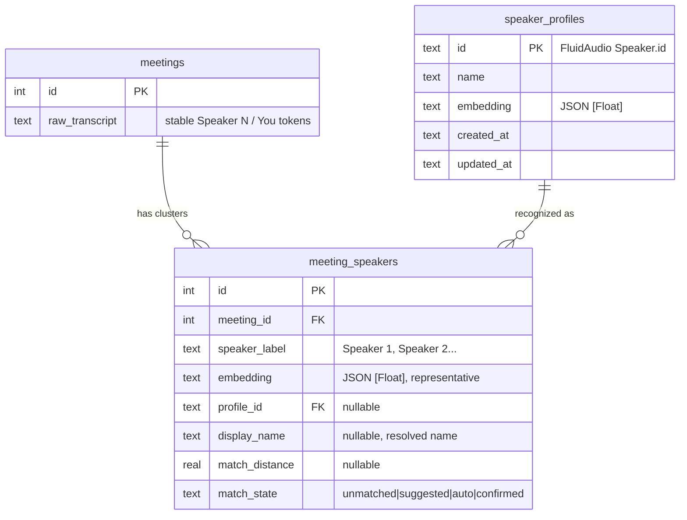
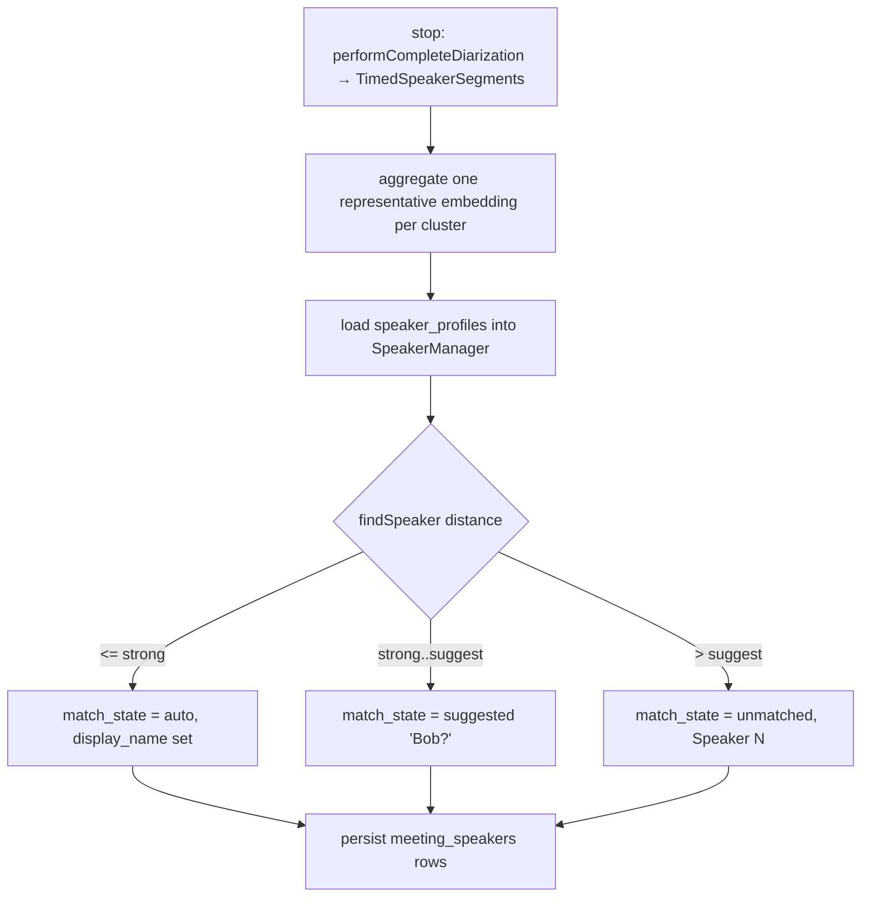
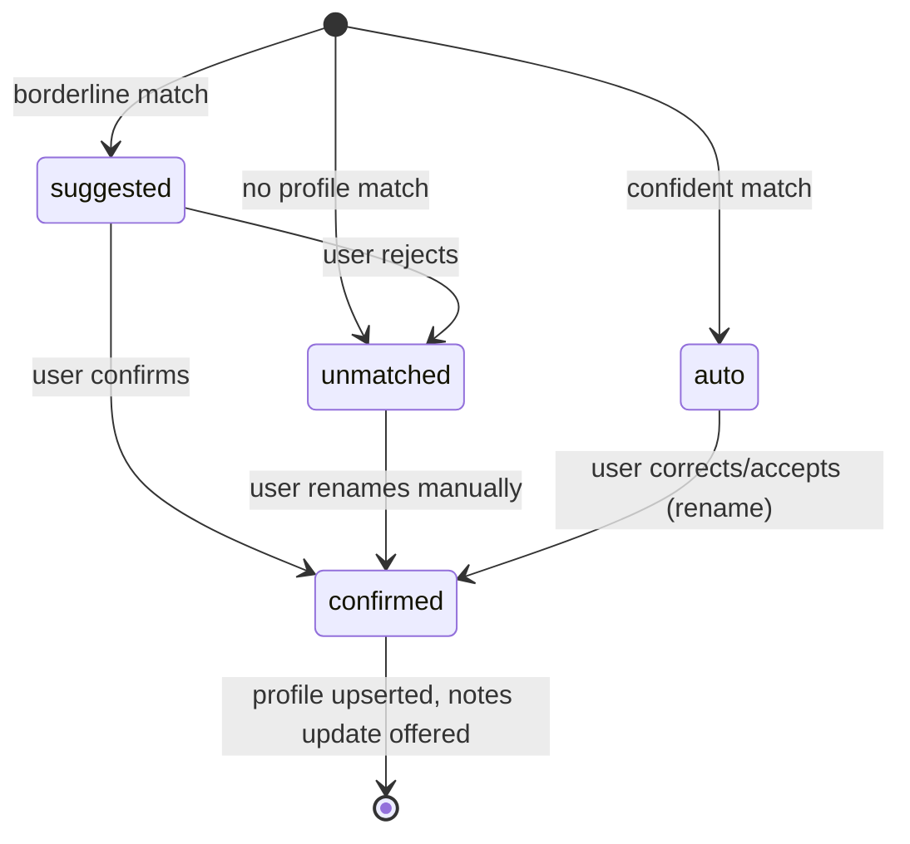

# feat: Named speakers + persistent voice profiles

## Summary

Replace `Speaker 1/2/3` in meeting transcripts and AI notes with real names, and
remember voices across meetings. After a meeting, the user renames a diarized
speaker; that saves a persistent local **voice profile** (name + voiceprint) and,
in future meetings, confidence-tiered recognition auto-names confident matches and
surfaces borderline ones as suggestions to confirm. Names are a **render-time
overlay** over stable `Speaker N` tokens, so corrections are instant; profiles are
managed in a Speakers library. Post-meeting only; built off upstream `main`.

---

## Problem Frame

Muesli diarizes meetings post-meeting (FluidAudio on the system-audio "Others"
stream) and labels speakers `Speaker 1/2/3` in the transcript. Those labels make
transcripts and notes hard to read ("Speaker 2 raised a pricing concern") and carry
no identity across calls, so a recurring participant is an anonymous "Speaker N"
every meeting. The diarizer already computes a 256-D voice embedding per speaker —
the exact material needed to recognize the same voice later — but the transcript is
stored as a plain-text blob and the embeddings are discarded after formatting
(`TranscriptFormatter.merge`), so today there is nothing to recognize against. See
origin: `docs/brainstorms/2026-06-01-named-speakers-voice-profiles-requirements.md`.

---

## Key Technical Decisions

- **Names are a render-time overlay, not rewritten stored text.** The stored
  transcript keeps stable `Speaker N` / `You` / `Others` tokens. A per-meeting
  `label → resolved name` map drives display substitution and AI-notes generation.
  Renames update the map (instant in the UI), never a fragile string-replace on the
  blob, and the existing transcript parser (which only accepts `You`/`Others`/`Speaker N`)
  stays unchanged. (see origin: Key Decisions — display-layer remap)

- **Capture per-speaker embeddings at meeting-stop.** Today `TimedSpeakerSegment.embedding`
  is thrown away after `TranscriptFormatter.merge`. We must persist one representative
  embedding per diarized cluster at stop — this is the prerequisite for both stable
  renaming and cross-call recognition. Consequence: auto-recognition applies only to
  meetings recorded after this ships (older meetings can still be renamed manually).

- **Recognition runs post-diarization via `SpeakerManager.findSpeaker`, not by
  pre-seeding the diarizer.** After `performCompleteDiarization`, each cluster's
  representative embedding is matched against loaded profiles; diarization output is
  unchanged. Confidence-tiered: distance below a strong threshold auto-names; between
  strong and suggest thresholds surfaces as a suggestion; above is unmatched. Exact
  thresholds are tuned in implementation (FluidAudio default `speakerThreshold` ≈ 0.65).

- **Two new DB tables; embeddings as JSON text.** `speaker_profiles` (the library)
  and `meeting_speakers` (per-meeting cluster → label, representative embedding,
  resolved profile/name/state). Embeddings serialize as JSON `[Float]` text, matching
  the existing `trace_json` precedent — the repo has **no** `sqlite3_*_blob` usage, so
  BLOB is deliberately avoided (corrects the brainstorm's "BLOB" wording).

- **"You" maps to the user's name at display time.** The mic stream stays the
  reserved `You` token in storage (the parser and `isUser` depend on it); the UI
  substitutes `config.userName` when rendering. Voice profiles are for **Others** only;
  the user's own voiceprint is never stored.

- **Notes reuse the existing re-summarize path.** AI notes are generated from a
  name-substituted transcript; a name correction offers a one-tap "update notes with
  corrected names" that reuses `MuesliController.resummarize` /
  `resummarizeAfterTranscriptEdit`.

- **Speaker profiles are DB-backed, the Speakers library mirrors the personas
  manager.** Unlike templates/personas (config-stored), profiles carry embeddings and
  are row-shaped, so they live in `DictationStore`; the management UI clones
  `CoachPersonasManagerView` with controller helpers delegating to the store.

- **Labels in the map must match labels realized in the stored blob.** `TranscriptFormatter`
  builds the `Speaker N` map over *all* diarization clusters, but a `Speaker N` token only
  lands in the transcript where a surviving (post-`TranscriptReconciler`) system ASR segment
  overlaps that cluster — and unmatched text falls back to the literal `Others`. So the
  per-meeting map must be derived from the *same post-reconcile assignment* that produces the
  blob: only emit `meeting_speakers` rows for labels actually realized in the transcript, and
  decide how `Others`-fallback text is handled. (Mismatched labels would make the overlay
  target speakers the user never sees.)

- **Embedding math mirrors FluidAudio.** A representative embedding is computed by
  L2-normalizing each segment embedding, averaging, then L2-normalizing the result (mirroring
  FluidAudio's `recalculateMainEmbedding`), and every embedding is validated as exactly 256-D
  before persist/load (FluidAudio silently drops wrong-sized vectors). The match threshold is
  ~0.65 cosine (`SpeakerManager.speakerThreshold`); the origin doc's "~0.45" was the unrelated
  `embeddingThreshold` — disregard it.

- **Profiles refine only on explicit user confirm, never on auto-recognition, and
  recoverably.** A confirm/rename re-averages stored raw embeddings (recoverable) rather than
  a blind irreversible EMA, and a borderline-confirmed sample is not allowed to drag a profile's
  centroid uncontrolled. Auto-recognition never mutates a profile. This prevents drift/poisoning
  over time. (Resolves the brainstorm's deferred "store raw embeddings" question.)

- **First-pass notes do not bake in auto-recognized names before the user reviews them.**
  Because notes are generated prose that can be exported/shared, the initial post-meeting
  summary uses `Speaker N` (or names only with a clearly-marked "auto" indicator); names enter
  the notes via the existing update-notes flow after the user has seen the transcript. This
  keeps the brainstorm's anti-misattribution rationale intact for the highest-stakes surface.

- **Automatic local enrollment, post-meeting only, off `main`.** Naming auto-saves a
  local profile (one-time note, deletable); nothing leaves the device; all of this
  runs in the post-meeting flow (no live recognition); developed on its own branch.

---

## High-Level Technical Design

Data model — profiles are the cross-call library; per-meeting rows link a meeting's
diarized clusters to profiles and carry the embedding captured at stop:

Recognition at meeting stop (post-diarization), confidence-tiered:

Per-cluster recognition/naming state (one `meeting_speakers` row):

---

## Requirements

Origin R-IDs cited where this plan carries a brainstorm requirement.

**Naming & display**

- R1. Post-meeting, the user can rename a diarized speaker in a transcript; the name
  applies across that meeting via the per-meeting label map. (origin R1)
- R2. The mic speaker renders as the user's name (or "You" if unset) at display time;
  no voice profile is created for the user. (origin R2)
- R3. Renaming updates the label map and re-renders instantly — no ASR/diarization/LLM
  re-run, no rewrite of the stored transcript text. (origin R3)

**Voice profiles & recognition**

- R4. Renaming a diarized (Others) speaker creates/updates a persistent local voice
  profile (name + representative embedding) and links the meeting's cluster to it. (origin R4)
- R5. In later meetings, each diarized cluster's embedding is matched against the
  profile library: confident matches are auto-named; borderline matches are surfaced
  as suggestions to confirm or reject. (origin R5)
- R6. Confirming/correcting a recognized name refines the linked profile; correcting a
  wrong auto-match relinks to the correct profile (or creates a new one) without
  polluting the mismatched profile. (origin R6)
- R7. Recognition and embedding capture run at the existing post-meeting diarization
  step; there is no live recognition. (origin R7)

**Speakers library**

- R8. A Speakers library lists saved profiles and supports rename, merge, and delete. (origin R8)
- R9. Deleting a profile removes its stored voiceprint. (origin R9)

**Notes**

- R10. Names appear in the transcript and in the AI notes (generated from a
  name-substituted transcript). (origin R10)
- R11. Correcting a name after notes are generated offers a one-tap "update notes with
  corrected names" (reuses re-summarize); the transcript reflects corrections
  immediately regardless. (origin R11)

**Privacy**

- R12. Voice profiles are stored locally, never leave the device, are disclosed by a
  one-time note on first enrollment, and are deletable. (origin R12, R13)

---

## Implementation Units

### U1. Persistence: speaker profiles + per-meeting speaker map

- **Goal:** Add the two tables and CRUD that everything else builds on.
- **Requirements:** R4, R8, R9, R12
- **Dependencies:** none
- **Files:**
  - `native/MuesliNative/Sources/MuesliCore/DictationStore.swift` (migration + CRUD)
  - `native/MuesliNative/Sources/MuesliCore/StorageModels.swift` (`SpeakerProfile`, `MeetingSpeaker` structs)
  - `native/MuesliNative/Tests/MuesliTests/SpeakerProfileStoreTests.swift` (new)
- **Approach:** In `migrateIfNeeded()` add `CREATE TABLE IF NOT EXISTS speaker_profiles (id TEXT PRIMARY KEY, name TEXT NOT NULL, embedding TEXT NOT NULL, raw_embeddings TEXT, observation_count INTEGER NOT NULL DEFAULT 1, created_at TEXT DEFAULT (datetime('now')), updated_at TEXT DEFAULT (datetime('now')))` (raw_embeddings + observation_count enable recoverable re-averaging refinement, not blind EMA) and `meeting_speakers (id INTEGER PRIMARY KEY AUTOINCREMENT, meeting_id INTEGER NOT NULL REFERENCES meetings(id) ON DELETE CASCADE, speaker_label TEXT NOT NULL, embedding TEXT NOT NULL, profile_id TEXT REFERENCES speaker_profiles(id) ON DELETE SET NULL, display_name TEXT, match_distance REAL, match_state TEXT NOT NULL DEFAULT 'unmatched')` plus indexes on `meeting_id` and `profile_id`. Embeddings (`[Float]`) serialize via `JSONEncoder` to text (mirror `insertComputerUseTrace`'s `trace_json`). Add CRUD: profiles (`upsertSpeakerProfile`, `speakerProfiles`, `renameSpeakerProfile`, `mergeSpeakerProfiles`, `deleteSpeakerProfile`) and per-meeting (`insertMeetingSpeaker`, `meetingSpeakers(for:)`, `updateMeetingSpeakerName`). Merge mirrors `deleteFolder`'s BEGIN/COMMIT/ROLLBACK transaction. **Delete must truly remove the voiceprint (R9):** the FK is `ON DELETE SET NULL` (keep the meeting's cluster row/label), but `deleteSpeakerProfile` also scrubs the `embedding` (and resolved name/state) on every linked `meeting_speakers` row in the same transaction — otherwise the per-meeting copies of the voiceprint survive. **Backup/at-rest hardening:** set `isExcludedFromBackup = true` on `muesli.db` and its `-wal`/`-shm` peers, and `0o600` perms, mirroring `ChatGPTAuthManager`/`ConfigStore` — biometric data must not silently replicate into iCloud/Time Machine.
- **Patterns to follow:** `meeting_folders` / `meeting_insights` table creation + idempotent ALTER (none needed for brand-new tables), `createFolder`/`renameFolder`/`deleteFolder` CRUD, `insertComputerUseTrace` JSON-text encoding, parameterized `?` binds throughout.
- **Test scenarios:**
  - Fresh DB creates both tables; migration is idempotent on re-run.
  - Upsert + fetch a profile round-trips name and embedding (JSON `[Float]` preserved within float tolerance).
  - `insertMeetingSpeaker` + `meetingSpeakers(for:)` round-trips label, embedding, profile_id, display_name, distance, state.
  - Deleting a meeting cascades its `meeting_speakers` rows (FK `ON DELETE CASCADE`, `PRAGMA foreign_keys=ON`).
  - Deleting a profile nulls `meeting_speakers.profile_id` (`ON DELETE SET NULL`) and removes the profile.
  - `mergeSpeakerProfiles(keep:remove:)` repoints `meeting_speakers.profile_id` and deletes the merged-away profile in one transaction.
  - `Covers R9.` Deleting a profile removes it from `speaker_profiles` AND scrubs the
    `embedding`/name on its linked `meeting_speakers` rows (no per-meeting voiceprint copy survives).
- **Verification:** Both tables migrate cleanly on fresh and existing DBs; profile/meeting-speaker CRUD round-trips; cascade/merge behave transactionally.

### U2. Capture cluster embeddings at meeting stop

- **Goal:** Persist one representative embedding per diarized cluster (and the `Speaker N` label mapping) before the segments are discarded.
- **Requirements:** R4, R7
- **Dependencies:** U1
- **Files:**
  - `native/MuesliNative/Sources/MuesliNativeApp/MeetingSession.swift` (capture in `stop()` after diarization, before finalize)
  - `native/MuesliNative/Sources/MuesliNativeApp/AudioFileImportController.swift` (same capture on the import path)
  - `native/MuesliNative/Sources/MuesliNativeApp/MuesliController.swift` (`retranscribe` path: recompute `meeting_speakers` + re-run recognition when the blob is rewritten)
  - `native/MuesliNative/Sources/MuesliNativeApp/SpeakerClusterAggregator.swift` (new — pure helper: segments → per-cluster representative embedding + label)
  - `native/MuesliNative/Tests/MuesliTests/SpeakerClusterAggregatorTests.swift` (new)
- **Approach:** Add a pure `SpeakerClusterAggregator` that takes the post-reconcile
  `diarizationSegments` and returns, per cluster, a representative embedding + the `Speaker N`
  label + raw id. **Label derivation:** reuse `TranscriptFormatter`'s actual assignment (the
  overlap match + `Others` fallback), not just first-appearance ordering, and only emit rows
  for labels actually realized in the stored blob — a cluster whose text was dropped by
  `TranscriptReconciler` or rendered as `Others` must not produce a dangling `Speaker N` row.
  **Representative embedding:** L2-normalize each segment embedding → average → L2-normalize
  (mirror FluidAudio `recalculateMainEmbedding`; prefer reusing `Speaker` semantics over
  re-implementing); validate 256-D. In `MeetingSession.stop()`, after `diarizeSystemAudio`
  and within the awaited drain-before-finalize ordering, persist `meeting_speakers` rows
  (state `unmatched`; U3 fills recognition). Mirror on the file-import path **and** the
  re-transcribe path (`retranscribe` re-runs diarization and rewrites the blob with fresh
  cluster numbering — it must delete-and-recompute that meeting's `meeting_speakers` rows and
  re-run recognition, never leave stale name→cluster mappings). Keep all of it inside the
  awaited flow so nothing writes post-finalize. The two-step `unmatched`-then-recognize split
  (U2/U3) is intentional for independent delivery/testing.
- **Execution note:** Add characterization coverage of `TranscriptFormatter`'s label
  assignment (overlap + `Others` fallback) first so the aggregator's labels match the blob exactly.
- **Patterns to follow:** `TranscriptFormatter.merge` first-appearance label map; `MeetingChunkCollector` drain-before-finalize ordering in `stop()`.
- **Test scenarios:**
  - Aggregator groups segments by `speakerId` and emits one row per cluster with the correct `Speaker N` label (first-appearance order matching `TranscriptFormatter`).
  - Representative embedding is L2-normalized-mean-normalized, deterministic, and 256-D; a wrong-sized vector is rejected, not silently dropped.
  - A cluster whose ASR text was dropped by reconcile or rendered as `Others` produces NO dangling `meeting_speakers` row (labels match the blob).
  - Empty/no-diarization input yields no rows (meeting with only "Others" fallback or mic-only produces none).
  - `Covers R4.` After a stop with 2 diarized speakers, exactly 2 `meeting_speakers` rows exist with embeddings.
- **Verification:** A completed meeting persists one `meeting_speakers` row per diarized cluster with a usable embedding and a label matching the transcript.

### U3. Recognition against the profile library

- **Goal:** Match each captured cluster against saved profiles and assign confidence-tiered names at stop.
- **Requirements:** R5, R6, R7
- **Dependencies:** U1, U2
- **Files:**
  - `native/MuesliNative/Sources/MuesliNativeApp/SpeakerRecognizer.swift` (new)
  - `native/MuesliNative/Sources/MuesliNativeApp/MeetingSession.swift` (invoke after capture) or `MuesliController` finalize path
  - `native/MuesliNative/Tests/MuesliTests/SpeakerRecognizerTests.swift` (new)
- **Approach:** `SpeakerRecognizer` loads `speaker_profiles` and, for each captured cluster embedding, computes the best match. Reuse FluidAudio matching by feeding profiles into a `SpeakerManager` (or `DiarizerManager.speakerManager`) via `initializeKnownSpeakers` and calling `findSpeaker(with:)` / `findMatchingSpeakers(with:)`; do not rely on FluidAudio's in-memory DB surviving launches — always load from our table. Apply two thresholds: `distance <= strongThreshold` → `match_state = auto` (set `display_name`, `profile_id`); `strongThreshold < distance <= suggestThreshold` → `suggested`; else `unmatched`. Persist results onto the `meeting_speakers` rows. Thresholds are named config/constants tuned in implementation. **Within-meeting assignment pass:** after per-cluster scoring, enforce at most one cluster per profile in a meeting — assign the closest cluster to a profile and demote the rest to `suggested`/`unmatched` (avoids two "Bob"s); and when two clusters strongly match each other (likely one person split), surface a merge suggestion rather than two names.
- **Patterns to follow:** `SpeakerManager.findSpeaker`/`findMatchingSpeakers` (cosine distance), the post-diarization seam in `TranscriptionRuntime`/`MeetingSession.stop()`.
- **Test scenarios:**
  - A cluster embedding near a stored profile (distance below strong) is marked `auto` with that profile's name and id.
  - A borderline embedding (between thresholds) is marked `suggested` with the candidate profile.
  - An embedding far from all profiles is `unmatched` (stays `Speaker N`).
  - With an empty profile library, all clusters are `unmatched` (first-ever meeting).
  - Tie-break: closest profile wins when multiple are within threshold.
  - Two clusters both matching one profile: only the closest is named; the other is demoted (no duplicate names in one meeting).
  - `Covers R5.` Given a saved "Bob" profile, a strongly-matching cluster is auto-named Bob.
- **Verification:** Recognition assigns correct tier/name/profile per cluster against the library, deterministic for given embeddings + thresholds.

### U4. Render-time name overlay in the transcript

- **Goal:** Display resolved names (and the user's name for "You") without changing stored transcript text.
- **Requirements:** R2, R3, R10
- **Dependencies:** U1
- **Files:**
  - `native/MuesliNative/Sources/MuesliNativeApp/MeetingDetailView.swift` (`MeetingTranscriptView` / `TranscriptChatMessage` rendering)
  - `native/MuesliNative/Sources/MuesliNativeApp/SpeakerNameResolver.swift` (new — pure: label + map + userName → display name)
  - `native/MuesliNative/Sources/MuesliNativeApp/MuesliController.swift` (`meetingSpeakers(for:)` accessor)
  - `native/MuesliNative/Tests/MuesliTests/SpeakerNameResolverTests.swift` (new)
- **Approach:** A pure `SpeakerNameResolver` maps a parsed speaker label to its display name: `You` → `config.userName` (or "You" if empty); `Speaker N` → the `meeting_speakers.display_name` when `match_state` is `auto`/`confirmed`, else the raw `Speaker N`; suggested matches render the label plus a suggestion affordance (U5). `MeetingTranscriptView` loads the meeting's speaker map and applies the resolver when building `TranscriptChatMessage`s; it already re-renders on transcript change, but a rename does NOT change the stored transcript string — so `MeetingTranscriptView` (which today takes only a `String`) must take the speaker map as an explicit observed input and re-render when the map mutates, not via `onChange(of: transcript)`. Keep `isUser` keyed on the underlying `You` token. **Auto vs confirmed:** `auto`-named speakers render with a subtle "auto-recognized" indicator (distinct from user-confirmed names) so the user knows to verify them before trusting/sharing — `confirmed` names show no indicator.
- **Patterns to follow:** `TranscriptChatMessage.messages(from:)` parsing + `.onChange` re-render; `config.userName` usage elsewhere.
- **Test scenarios:**
  - `You` resolves to `config.userName`; falls back to "You" when unset.
  - `Speaker 1` with a confirmed map entry resolves to the name; with no entry stays "Speaker 1".
  - A `suggested` entry resolves to the base label (name shown only as a suggestion, not applied).
  - `isUser` stays true for the mic speaker regardless of the displayed name.
  - Empty map (no `meeting_speakers` rows — pre-feature or no-diarization meeting): all speakers render with raw labels, no crash, no substitution.
  - `auto` entries render with the auto-recognized indicator; `confirmed` entries do not.
  - `Covers R2, R10.` Mic renders as the user's name; named Others render with their names.
- **Verification:** Transcript shows resolved names without altering stored text; unset/edge cases fall back cleanly.

### U5. Rename + recognition-confirm UI

- **Goal:** Let the user name/correct speakers and confirm/reject suggestions in the transcript.
- **Requirements:** R1, R3, R4, R5, R6, R11
- **Dependencies:** U1, U4
- **Files:**
  - `native/MuesliNative/Sources/MuesliNativeApp/MeetingDetailView.swift` (rename affordance on speaker labels + suggestion chips)
  - `native/MuesliNative/Sources/MuesliNativeApp/MuesliController.swift` (`renameMeetingSpeaker`, `confirmSuggestedSpeaker`, `rejectSuggestedSpeaker`)
  - `native/MuesliNative/Tests/MuesliTests/SpeakerNamingControllerLogicTests.swift` (new — pure helpers where extractable)
- **Approach:** Tapping a speaker label (on its metadata line) opens an inline rename field
  pre-filled with the current display name; commit on Return, cancel on Escape/click-away; the
  rename applies to **all** lines of that speaker (per-meeting map) with a brief highlight so
  the user sees it propagated. Borderline (`suggested`) speakers show one "Name?" chip per
  speaker (not per line) with confirm/reject. On rename/confirm: update the `meeting_speakers`
  row (`display_name`, `match_state = confirmed`), upsert the `speaker_profiles` entry and
  **refine recoverably** — append this cluster's embedding to the profile's `raw_embeddings`
  and re-average (bounded), never a blind EMA, and refine **only** on this explicit user action
  (never on auto-recognition); link `profile_id`; re-render instantly. Correcting a wrong
  auto-match relinks to the correct/new profile without touching the mismatched one. Reject
  clears the suggestion to `unmatched`. **Update-notes affordance:** a single debounced
  "Update notes with corrected names" action (toolbar button, enabled after any name change),
  not an alert per rename, and suppressed when no notes exist yet.
- **Patterns to follow:** existing `isEditingTranscript`/inline-edit affordances in `MeetingDetailView`; the "Re-summarize Notes?" alert + `resummarizeAfterTranscriptEdit`.
- **Test scenarios:**
  - Renaming `Speaker 1` → "Bob" sets the map entry to confirmed/Bob and upserts a Bob profile linked by `profile_id`.
  - Confirming a "Bob?" suggestion sets confirmed + links the existing profile; rejecting returns it to unmatched.
  - Correcting an auto-named Bob → Carol relinks to Carol and leaves Bob's profile unchanged. `Covers R6.`
  - Renaming offers the notes-update affordance and updates the transcript instantly. `Covers R11.`
- **Verification:** Naming/confirming/correcting updates the map + profiles correctly, re-renders instantly, and never pollutes a mismatched profile.

### U6. Speakers library UI

- **Goal:** Manage saved voice profiles (view/rename/merge/delete) and the one-time privacy note.
- **Requirements:** R8, R9, R12
- **Dependencies:** U1
- **Files:**
  - `native/MuesliNative/Sources/MuesliNativeApp/SpeakersManagerView.swift` (new — modeled on `MeetingTemplatesManagerView`; the coach personas manager lives on a separate branch, so do not look for it here)
  - `native/MuesliNative/Sources/MuesliNativeApp/SettingsView.swift` (entry point)
  - `native/MuesliNative/Sources/MuesliNativeApp/MuesliController.swift` (`speakerProfiles`, `renameSpeakerProfile`, `mergeSpeakerProfiles`, `deleteSpeakerProfile`)
  - `native/MuesliNative/Sources/MuesliNativeApp/Models.swift` (`hasSeenVoiceProfileNote` config flag — three-place add)
  - `native/MuesliNative/Tests/MuesliTests/SpeakerProfileStoreTests.swift` (extend for merge/delete via controller-agnostic store calls)
- **Approach:** A `SpeakersManagerView` listing profiles by name with rename, merge, and delete (confirm alert). Present from Settings via a `@State showingSpeakersManager` + `.sheet`, modeled on `MeetingTemplatesManagerView`. **Merge UX:** multi-select two profiles + a "Merge" action; the kept profile's name wins (or user picks); confirm step states that past meetings repoint to the kept profile. **Empty state:** explain the enrollment path ("Name a speaker in a meeting transcript to create a profile"). Also expose a path to this library from the transcript naming flow (e.g., from the one-time note), not Settings-only. Controller helpers delegate to `DictationStore` then `syncAppState()`. A one-time note (gated by a tolerant-decoded config bool) explains local voiceprint storage on first enrollment (shown from U5's first rename).
- **Patterns to follow:** `CoachPersonasManagerView` + `SettingsView` sheet/`actionButton` wiring; three-place `AppConfig` add (member + snake_case CodingKey + tolerant decode).
- **Test scenarios:**
  - `Test expectation: UI behavior verified manually; unit tests cover the store merge/delete + the config-flag round-trip (one-time note shows once).`
  - Config round-trip: `hasSeenVoiceProfileNote` persists; missing key decodes false (note shows once).
- **Verification:** Profiles are listable, renamable, mergeable, deletable; the one-time note shows exactly once; deletion removes voiceprints.

### U7. Notes integration (names in summary + update-on-correction)

- **Goal:** Make AI notes use names, and let a correction refresh them.
- **Requirements:** R10, R11
- **Dependencies:** U1, U4, U5
- **Files:**
  - `native/MuesliNative/Sources/MuesliNativeApp/MuesliController.swift` (apply name substitution to the transcript fed to summarization; wire "update notes" to re-summarize)
  - `native/MuesliNative/Sources/MuesliNativeApp/MeetingSummaryClient.swift` (reference — summarize input)
  - `native/MuesliNative/Tests/MuesliTests/SpeakerNameSubstitutionTests.swift` (new — pure substitution over a transcript blob)
- **Approach:** Add a pure substitution that rewrites a transcript blob's speaker labels to
  resolved names (meeting map + userName) for the *summarizer input only* (the stored blob keeps
  tokens); `unmatched`/`suggested` labels stay `Speaker N`. There is no existing seam to inject a
  substituted transcript — `resummarize`/the `stop()` summarize both read `meeting.rawTranscript`
  directly — so thread a `transcriptOverride: String?` param through the private
  `resummarize(meeting:using:completion:)` and the `MeetingSession.stop()` summarize call. **First-pass
  notes do NOT bake in auto-recognized names** (a wrong auto-name would propagate into shared/exported
  notes before the user ever reviews it): the initial post-meeting summary uses `Speaker N`, and names
  enter the notes only after the user reviews the transcript, via the debounced "update notes with
  corrected names" affordance (U5) which calls `resummarize` with the name-substituted transcript.
- **Patterns to follow:** `MuesliController.resummarize` → `MeetingSummaryClient.summarize`; the existing "Re-summarize Notes?" alert.
- **Test scenarios:**
  - Substitution replaces `Speaker 1:` / `You:` line labels with resolved names, leaving timestamps and text intact.
  - Unmatched/`suggested` labels are left as `Speaker N` in the summarizer input.
  - `You` substitutes to `config.userName` (or stays "You" when unset).
  - `Covers R10.` Summarizer input for a meeting with named speakers contains the names, not `Speaker N`.
- **Verification:** Notes generate with names; correcting a name and choosing "update notes" regenerates them with the corrected names.

---

## Acceptance Examples

- AE1. **Covers R4, R5.** Given Bob was named in a past meeting, when a new meeting is
  diarized and a cluster strongly matches Bob's voiceprint, then that cluster is
  `auto`-named "Bob" in the transcript.
- AE2. **Covers R5.** Given a borderline match to Bob, then the speaker shows a "Bob?"
  suggestion the user can confirm or reject; rejecting leaves it as `Speaker N`.
- AE3. **Covers R6.** Given a cluster was auto-named Bob but is actually Carol, when
  the user corrects it, then the transcript updates instantly, Bob's profile is
  untouched, and Carol's profile is created/updated and linked.
- AE4. **Covers R10, R11.** Given names were corrected after notes were generated, then
  the transcript reflects names immediately and the user is offered "update notes with
  corrected names".
- AE5. **Covers R2.** The mic speaker renders as the user's name (or "You"), and no
  voice profile is created for the user.
- AE6. **Covers R9, R12.** Deleting a profile in the Speakers library removes its
  voiceprint; voiceprints never leave the device.

---

## Scope Boundaries

### Deferred for later (from origin)

- Live (in-meeting) named coaching / streaming diarization — recognition stays
  post-meeting.
- Names in the coach recap — deferred until this merges with the Live Meeting Coach
  branch.
- Dedicated enrollment capture (record/import a voice sample to pre-seed a profile).
- Retroactive re-diarization of pre-existing meetings to recognize them (renaming
  still works on any already-diarized meeting).

### Outside this product's identity (from origin)

- Cloud-based voiceprint storage or sending biometric embeddings off-device. Profiles
  stay on-device, consistent with Muesli's local-first promise.

### Deferred to Follow-Up Work

- Exposing voice profiles / per-speaker data via `MuesliCLI` — out of scope here
  (parallels the coach CLI follow-up).
- Switching embedding storage from JSON text to a true BLOB column — JSON text is the
  v1 choice; revisit only if storage size becomes a concern.

---

## Risks & Dependencies

- **Embedding is the load-bearing prerequisite.** All recognition depends on capturing
  `TimedSpeakerSegment.embedding` at stop (U2) before it's discarded; if capture is
  wrong/missing, the library never populates. Verified the field exists and is 256-D.
- **Recognition is probabilistic.** Threshold tuning (strong vs suggest) directly sets
  the false-name rate; the confidence tiers + easy correction (U5) are the mitigation.
  Defaults anchor on FluidAudio's `speakerThreshold` ≈ 0.65 and are tuned in implementation.
- **In-memory `SpeakerManager` does not persist across launches**, and
  `getDiarizerManager()` can be nil if model download/init failed — recognition must
  load our `speaker_profiles` each run and degrade gracefully when the diarizer is
  unavailable (no names, no crash).
- **Transcript parser only accepts `You`/`Others`/`Speaker N`.** The render-time
  overlay keeps those tokens stored, so the parser is unchanged — do not introduce
  arbitrary names into the stored blob.
- **Drain-before-finalize.** Embedding capture/recognition at stop must complete within
  the awaited `stop()` flow so nothing writes after the transcript is persisted
  (`MeetingChunkCollector` precedent).
- **First-BLOB-avoidance.** Embeddings are JSON text; do not assume BLOB plumbing
  exists (it doesn't).
- **Third-party biometric consent.** Voiceprints are captured for participants who never
  consented; the one-time note addresses the *host*, not the subjects. Accepted under the
  local-only posture, but BIPA/CUBI/GDPR Art. 9 exposure is real for regulated users — record
  it as an accepted risk; it elevates if cloud backup or enterprise use is ever added.
- **Named transcripts now cross the cloud boundary.** Once names substitute into the summarizer
  input, real participant names (previously pseudonymous `Speaker N`) are sent to the chosen
  cloud LLM backend. Update the cloud-summary disclosure to say participant names are included.
- **Day-one value gap.** Recognition only works for meetings recorded after ship (no retroactive
  re-diarization), so existing users get manual naming immediately but cross-call recognition
  only after recurring participants reappear. Set this expectation in the Speakers library empty
  state, and treat "dedicated enrollment capture" as the natural fast-follow for immediate value.

---

## System-Wide Impact

- **New persisted data:** `speaker_profiles` (biometric voiceprints) and
  `meeting_speakers`, both local, additive migrations. Deleting a meeting cascades its
  speaker rows; deleting a profile nulls links.
- **Config surface:** one new tolerant-decoded flag (`hasSeenVoiceProfileNote`).
- **Meeting-stop path touched:** embedding capture + recognition added post-diarization
  inside the awaited finalize ordering.
- **Privacy posture:** introduces stored voiceprints of other participants — local-only,
  disclosed once, deletable (a deliberate, scoped expansion of on-device data).

---

## Open Questions (Deferred to Implementation)

- Exact `strongThreshold` / `suggestThreshold` values and whether to expose them.
- Bound for the recoverable re-average (max raw embeddings kept per profile). The rule is
  decided (normalize-mean-normalize; refine only on explicit confirm); only the cap is open.
- Whether recognition seeds `initializeKnownSpeakers` before diarizing (future) vs
  post-hoc `findSpeaker` matching (this plan's choice).
- Final styling of the "auto-recognized" indicator and the rename/merge affordances —
  mechanics are specified in U4/U5/U6; visual polish is deferred.

---

## Sources & Research

- Origin requirements: `docs/brainstorms/2026-06-01-named-speakers-voice-profiles-requirements.md`
- Transcript formatting + storage: `native/MuesliNative/Sources/MuesliNativeApp/TranscriptFormatter.swift`
  (`Speaker N` label map, line format), `MeetingDetailView.swift` (`TranscriptChatMessage`
  parsing, `isLikelySpeakerLabel`/`isUser`, `.onChange` re-render), `MeetingSession.swift`
  (`stop()` diarize→reconcile→summarize ordering), `DictationStore.swift`
  (`meetings.raw_transcript` blob; `meeting_folders`/`computer_use_traces` table + JSON-text precedents).
- Diarization + recognition: `native/MuesliNative/Sources/MuesliNativeApp/TranscriptionRuntime.swift`
  (`diarizeSystemAudio`, long-lived `DiarizerManager`), FluidAudio
  `Diarizer/Core/DiarizerManager.swift` (`speakerManager`, `initializeKnownSpeakers`,
  `extractSpeakerEmbedding`), `Diarizer/Clustering/SpeakerManager.swift`
  (`findSpeaker`, `findMatchingSpeakers`, `mergeSpeaker`; default `speakerThreshold` ≈ 0.65),
  `Diarizer/Clustering/SpeakerTypes.swift` (`Speaker`: Codable, name + `currentEmbedding`),
  `Diarizer/Core/DiarizerTypes.swift` (`TimedSpeakerSegment.embedding`, 256-D).
- Management UI + config: `native/MuesliNative/Sources/MuesliNativeApp/CoachPersonasManagerView.swift`,
  `SettingsView.swift` (sheet/actionButton), `Models.swift` (three-place config add, `userName`).
- Notes regeneration: `native/MuesliNative/Sources/MuesliNativeApp/MuesliController.swift`
  (`resummarize`), `MeetingSummaryClient.swift` (`summarize`), `MeetingDetailView.swift`
  ("Re-summarize Notes?" alert).
- Conventions: `docs/reports/2026-03-19-audit-hardening-report.md` (parameterized binds;
  drain-before-finalize), `CLAUDE.md` (diarization is post-processing; DictationStore conventions; App Nap).
